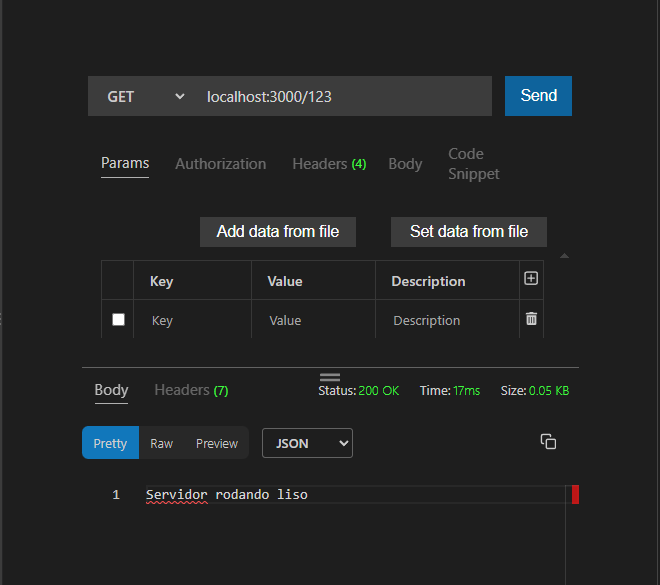
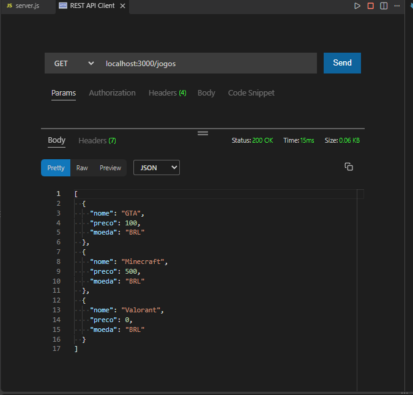
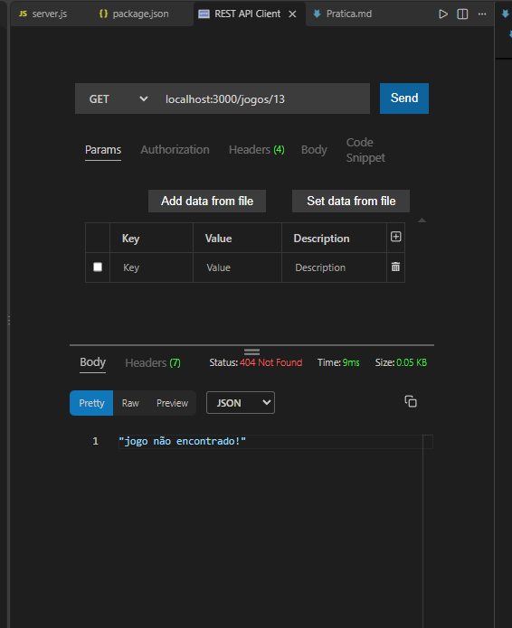
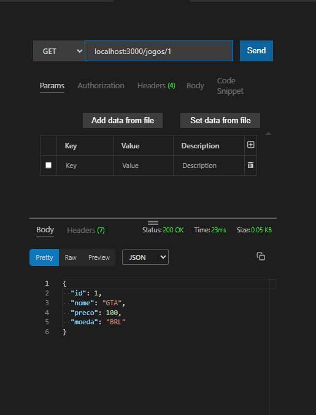
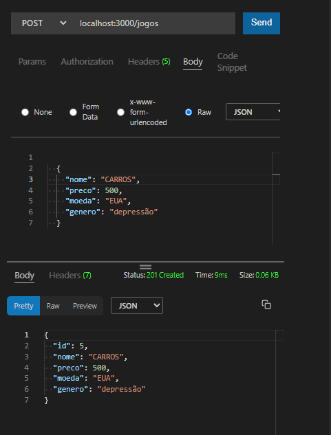
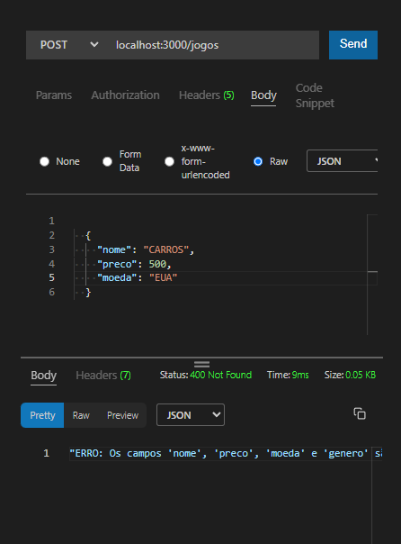

Parte 1 — Criar projeto

 9. Servidor na porta 3000.
 10. Criar GET /.
 Testar GET / no Postman.
 R:
Parte 3 — Array de jogos
 19. Criar array jogos com pelo menos 3 objetos.
 20. Criar GET /jogos.
 21. Testar no Postman.
 
 22. Criar GET /jogos/:id.
 23. Usar req.params.id.
 24. Usar find().
 25. Retornar 404 se não encontrar.
 
 26. Testar ID existente e inexistente.
 
Parte 4 — POST
 27. Criar POST /jogos.
 28. Receber Body JSON.
 29. Usar req.body.
 30. Criar ID automaticamente.
 31. Usar push().
 32. Validar titulo e genero.
 33. Retornar status 201.
 
 34. Testar POST válido.
 35. Testar POST inválido.
 
Parte 5 — PUT
 36. Criar PUT /jogos/:id.
 37. Localizar pelo ID.
 38. Permitir alterar dados pelo Body.
 39. Retornar 404 se não existir.
 40. Retornar objeto atualizado.
 41. Testar atualização válida.
 42. Testar ID inexistente.
Parte 6 — DELETE
 44. Criar DELETE /jogos/:id.
 45. Usar findIndex().
 46. Usar splice().
 47. Retornar 404 se não existir.
 48. Confirmar exclusão.
 49. Testar DELETE.
 51. Fazer GET depois e comprovar remoção.
Parte 7 — Rota especial
 52. Criar GET /jogos/melhores.
 53. Retornar jogos com nota ≥ 8.
 54. Usar filter().
 55. Testar no Postman.
Parte 9 — JSON
 65. Criar pasta dados.
 66. Criar jogos.json com os jogos.
 67. Ler jogos.json com fs.
 68. Usar JSON.parse().
 69. Fazer GET buscar os dados do arquivo.
 70. Fazer POST salvar no arquivo.
 71. Reiniciar servidor e verificar persistência.
 73. Adaptar PUT para salvar no JSON.
 74. Adaptar DELETE para salvar no JSON.
 75. Testar GET, POST, PUT e DELETE novamente.
Parte 10 — Histórico TXT
 76. Criar historico.txt.
 77. Registrar cadastro.
 78. Registrar atualização.
 79. Registrar remoção.
 80. Usar appendFile ou appendFileSync.
 81. Criar GET /historico.
 82. Testar no Postman.
Parte 12 — path
 93. Usar path.join() para jogos.json.
 94. Usar path.join() para historico.txt.
Parte 13 — Tratamento de erros
 97. try/catch em leitura de arquivo.
 98. try/catch em escrita de arquivo.
 99. Retornar erro apropriado em rota.
 100. Testar erro controlado e registrar no README.
Parte 14 — Assíncrono
 108. Se usar versão assíncrona, envolver em try/catch.
Parte 17 — Postman
 122. GET /
 123. GET /jogos
 124. GET /jogos/:id
 125. POST /jogos
 126. PUT /jogos/:id
 127. DELETE /jogos/:id
 128. GET /jogos/melhores
 129. GET /historico
 130. Prints das operações.
 131. Prints mostrando Body JSON no POST/PUT.
 132. Pelo menos um teste 404.
 133. Pelo menos um teste 400.
 134. Pelo menos um teste 201.
Parte 18 — Organização
 136. Organizar server.js, package.json, dados/jogos.json, dados/historico.txt e README.md.
 137. Não enviar node_modules.
 138. Colocar comandos de instalação/inicialização no README.
 139. Colocar respostas teóricas no README.
 140. Colocar prints do Postman.
 141. Enviar repositório no GitHub.